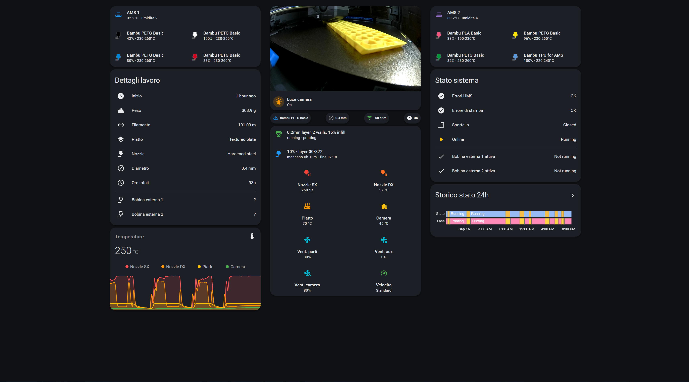

# x2d-dashboard

Dashboard Home Assistant per **Bambu Lab X2D** con due AMS, basata sull'integrazione
[ha-bambulab](https://github.com/greghesp/ha-bambulab).

Tutto in una schermata, tre colonne, tema scuro.



---

## Cosa mostra

| Colonna 1 | Colonna 2 | Colonna 3 |
|---|---|---|
| AMS 1 — 4 slot con colore reale del filamento, % rimanente, range temperature | Camera live + luce camera | AMS 2 — 4 slot |
| Dettagli lavoro + bobine esterne | Chip: tray attivo, diametro nozzle, Wi-Fi, HMS | Stato sistema (HMS, errori, sportello, online) |
| Grafico temperature 6h | Stato, avanzamento, 4 temperature, 4 ventole | Storico stato 24h |

---

## Requisiti

### Integrazione

[](https://my.home-assistant.io/redirect/hacs_repository/?owner=greghesp&repository=ha-bambulab&category=integration)

### Card custom (HACS → Frontend)

| Componente | Installa |
|---|---|
| Mushroom | [](https://my.home-assistant.io/redirect/hacs_repository/?owner=piitaya&repository=lovelace-mushroom&category=plugin) |
| card-mod | [](https://my.home-assistant.io/redirect/hacs_repository/?owner=thomasloven&repository=lovelace-card-mod&category=plugin) |
| stack-in-card | [](https://my.home-assistant.io/redirect/hacs_repository/?owner=custom-cards&repository=stack-in-card&category=plugin) |
| mini-graph-card | [](https://my.home-assistant.io/redirect/hacs_repository/?owner=kalkih&repository=mini-graph-card&category=plugin) |

Dopo l'installazione: **riavvia Home Assistant** e fai un hard refresh del browser (`Ctrl+Shift+R`).

> **card-mod** va caricato come *frontend module*, non solo come risorsa Lovelace:
> ```yaml
> # configuration.yaml
> frontend:
>   extra_module_url:
>     - /hacsfiles/lovelace-card-mod/card-mod.js
> ```

---

## Installazione

### 1. Tema

Copia [`themes/bambu_dark.yaml`](themes/bambu_dark.yaml) in `<config>/themes/bambu_dark.yaml`.

In `configuration.yaml`:

```yaml
frontend:
  themes: !include_dir_merge_named themes
```

Poi **riavvia** Home Assistant (per i temi il reload non basta).
Verifica: profilo utente → menu *Tema* → deve comparire `bambu_dark`.

[](https://my.home-assistant.io/redirect/profile/)

> Non trovi i file? Installa l'add-on **File editor** (nelle versioni recenti di HA la
> sezione Add-ons si chiama **Apps**). Nel File editor la cartella `homeassistant/` **è** `/config`.
>
> [](https://my.home-assistant.io/redirect/supervisor_store/)

### 2. Trova i tuoi entity_id

Vedi [`docs/dump-entita.md`](docs/dump-entita.md). Servono quattro valori:

| Segnaposto | Cos'è | Esempio |
|---|---|---|
| `MY_PRINTER` | slug del device stampante | `x2d_soggiorno` |
| `MY_AMS1` | slug del primo AMS | `ams_01` |
| `MY_AMS2` | slug del secondo AMS | `ams_02` |
| `MY_SERIAL` | prefisso con seriale (bobine esterne) | `x2d_00m09a123456789` |

### 3. Dashboard

1. Crea una dashboard nuova
2. ⋮ → **Modifica dashboard** → ⋮ → **Modifica in YAML**
3. Incolla il contenuto di [`dashboard.yaml`](dashboard.yaml)
4. Find & replace dei quattro segnaposto

---

## Configurazione lato stampante

Alcune entità non esistono finché non abiliti queste opzioni **sulla stampante**:

| Opzione | Sblocca |
|---|---|
| **LAN Only Liveview** (impostazioni LAN) | camera — non richiede LAN Only Mode completa |
| **Store Sent Files on External Storage** + chiavetta USB/SD | anteprima lavoro, peso, tipo piatto |
| **LAN Only Mode** | entità di controllo (`button.`, `number.`, `select.`) |

> ⚠️ **Modalità Hybrid** (cloud + IP locale) è quella che ottieni inserendo l'IP senza mettere
> la stampante in LAN Only. Sui firmware recenti tutte le **letture** funzionano, ma le
> **scritture** sono bloccate: l'unico controllo attivo resta la luce camera.
> Per riavere i comandi serve la LAN Only Mode vera, che però fa perdere print history e app Handy.

Sulle **ventole**: su H2/X2 non esistono come dominio `fan.`, solo sensori di velocità in sola lettura.

---

## Note e limiti noti

- **Camera single-client**: l'endpoint RTSPS della stampante accetta *una* connessione. Se guardi
  da Bambu Studio, la dashboard perde lo stream. Soluzione: [go2rtc come relay](docs/go2rtc.md).
- **Entity_id fragili**: quelli delle bobine esterne contengono il numero di serie.
  Reinstallando l'integrazione cambiano.
- **Anteprima lavoro**: commentata di default nel YAML, perché senza USB resta un riquadro vuoto.
- **Card native di ha-bambulab** (`ha-bambulab-ams-card` ecc.): sono già incluse nell'integrazione,
  ma nella combinazione X2D + hybrid + 2 AMS renderizzano vuote (testato con cards v0.6.54).
  Per questo qui sono ricostruite con Mushroom.
- **Colore filamento**: l'attributo `color` è `RRGGBBAA` (8 cifre). Il template tronca a 6 perché
  l'alpha rompe il rendering.
- **Markdown card e CSS**: la markdown card di HA passa l'HTML attraverso DOMPurify, che elimina
  `style=` e `class=`. Per questo gli slot AMS usano Mushroom e non una tabella markdown.

---

## Licenza

MIT — vedi [LICENSE](LICENSE).

## Crediti

- [greghesp/ha-bambulab](https://github.com/greghesp/ha-bambulab) — integrazione
- [bbbenji](https://community.home-assistant.io/t/my-bambu-lab-x1c-dashboard-automations/665646) — ispirazione per il layout
- [WolfwithSword](https://www.wolfwithsword.com/bambulab-home-assistant-dashboard/) — configuratore dashboard Bambu
